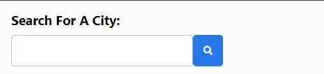

# Homework-06-Server-Side-APIs
Weather Dashboard


Third-party APIs allow developers to access their data and functionality by making requests with specific parameters to a URL. Developers are often tasked with retrieving data from another application's API and using it in the context of their own. Your challenge is to build a weather dashboard that will run in the browser and feature dynamically updated HTML and CSS.

Use the [OpenWeather API](https://openweathermap.org/api) to retrieve weather data for cities. The documentation includes a section called "How to start" that provides basic setup and usage instructions. You will use `localStorage` to store any persistent data.

## User Story

```
AS A traveler
I WANT to see the weather outlook for multiple cities
SO THAT I can plan a trip accordingly
```

## Acceptance Criteria

```
GIVEN a weather dashboard with form inputs
WHEN I search for a city
THEN I am presented with current and future conditions for that city and that city is added to the search history
WHEN I view current weather conditions for that city
THEN I am presented with the city name, the date, an icon representation of weather conditions, the temperature, the humidity, the wind speed, and the UV index
WHEN I view the UV index
THEN I am presented with a color that indicates whether the conditions are favorable, moderate, or severe
WHEN I view future weather conditions for that city
THEN I am presented with a 5-day forecast that displays the date, an icon representation of weather conditions, the temperature, and the humidity
WHEN I click on a city in the search history
THEN I am again presented with current and future conditions for that city
```

## Mock-Up

The following image shows the web application's appearance and functionality:


# Start of the project

### Breakdown

1. Header - Weather Dashboard
2. Search button section - Includes a h2 tag, input and save button. Icon I can get from font awesome website.
3. Get open weather map API
4. Daily weather container: Name, date, icon, temp, humidity, wind speed, UV index.
5. 5-day forecast container: Need to make a loop for the 5 days, including a different card for each day. This one only includes date, icon, temp and humidity.
6. Search history: this is where I need to use local storage. User can click on one of the buttons and will take you to that city's weather.


## Header
Since we have completed our 6th week, I have become pretty confident with CSS. At least the basics of it! For this header, I just needed to add a h1 tag, center it, make the background navy. Easy! 


## Search Section
We have covered buttons and forms in class and in our homework a few times now, so I was also feeling confident here too.
I needed to add an input for the user to write which city they wanted. Then a search button next to it, so once it clicks, information on that city will pop up.
In my javascript file, I went ignored jquery for now as I felt more confident with plain javascript. I knew later on I would change to jQuery, so basically doing twice the work! I think for now while I am learning, it's a good thing. More practice for me!




## Daily weather container

Time to get the API data! I did this by getting a key from their website that I have to use at the end of my url. I created a variable called city-name. This is to take in what the user wrote in the search section. I then use the variable in my url. This then gives me a range of data I can use to fill in my container.
To get the correct data I wanted, like temperature and humidity, I have to go through their array's to find the exact path that I wanted. For Temp and wind speed, they were in different units to the ones I wanted. So I had to create a function to correct this. One of them was convert Kelvin to Celsius. This is done with a simple math equation. I choose to make functions as I would have to use it again for my forecast. 


While creating this container, I wasn't quite sure how I was going to tackle the UV index. I think I overcomplicated it in my head. But it was in the data paths the whole time. At that point in time, I left it and moved on as there was a lot more to do.
Next was getting the icon, for some reason when I appended it to id of date, it wasn't perfectly square. To correct this, I added a class in my js that had the correct measurements. THis fixed the problem.
Lastly, the date! I managed to get the date but not in the correct format. Once again, I left this and decided it was a future me problem. At this time, I just wanted everything working first. Then at the end, I could fix all of these small problems.


## Forecast

Forecast! Taking what I had just learnt and practiced, and pushing me one step further! For a 5 day forecast, I need to create 5 cards. The Best way to do this (well, the best way I know how to do this) is to put this into a for loop. That meant I didn't have to create the same card 5 times in the html. I ran into a road block with my url. I chose this url as it said it was a 5 day forecast, and within that I saw it had the current day forecast too. But after looking more into this, it had three different forecasts for each day in their array. Surely there was a better way than having to select every 3rd one... Back to exploring the website.

I came across a 7 day forecast. Here it had a daily forecast and wasn't complicated. This was good as I was able to start with the 2nd day and end on the 6th day. However, to use this, I had to get the lon and lat of the city that was chosen. But that wasn't too hard, as all you had to do was select that data from the first url.
Now that I had my 5 days, I wanted to check to make sure the loop was working correctly.


Once I had that, I knew filling out the rest of the card would be fine. I then thought that I would take some time to fix the format of the date. I did this by creating a function that converted the time stamp to a string. Within this, I was able to collect the data for the date, month and year and put it into the format I wanted.


Cards are completed! Next I decided to tackle the UV Index. I originally thought I would have to get a different url for this too, but then  I found it in one of the paths. It was labelled as uvi, which I think I missed the first time as I was looking for the word index while I was skimming over. Lesson learnt: Take your time reading Kate!
With the index done, I moved on to colour coding the index. With this, I used an if statement to say if it was between certain numbers, then go to this colour. Severe is red, moderate is yellow and favourable I made green.


## Search History

Local storage time! Once again, we have done this a few times now, do I was pretty confident with what I had to do here. Within my JS, with each city that was search, I saved and added a button. This way, once the user clicks the button, it will go directly to that city.
I made a list that is 6 buttons long. I decided to do this as I wanted the list to show when the user refreshes the page or comes back to it after using the website. If I did not shorten the list, it would just carry on forever. No one wants that.


## Country Issues!

While I was testing may code to see if it worked, I was only checking Dunedin's weather. So when I decided to spice things up and search other places. I started to see a few issues. First I went through main cities of New Zealand. It was Hamilton that said it was really cold. I didn't think too much of this but was thinking that it shouldn't be that cold. Then I looked up Melbourne, it said it was night time and freezing cold. Looked outside, and it was mid day and it was super hot! Something was not right!
I checked my data to see what was happening and saw that it was in the America timezone! I checked Hamilton and yes, it was not New Zealand's Hamilton. 
So to help people (mostly me, so I don't get confused), I have added the country. So if the user looks up Melbourne, they can see what country they looked up. To get Australia, all the user needs to do is add ", AU" to the end. This will take you to the correct Melbourne.


# Results

When the page loads, the user will be presented with their chosen city's weather. Within this section is the search bar for the user to enter their chosen city.
Once the search button is clicked, their chosen city's forecast will appear. The main section is for the current day, then below is a 5-day forecast. Their city is also saved to search history (this is below the search bar). That means if the user looks up multiple cities, they can easily go back to one by clicking on the name. If the user exits out of the window and reloads the page, their search history will still be there. This will save the user time if they constantly look up their favourite cities.

Link: 


